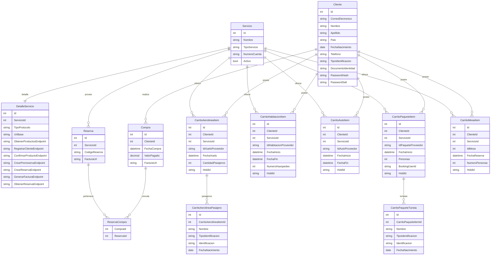

# TravelioDatabaseConnector

Acceso a datos con Entity Framework Core para SQL Server. Incluye tablas de clientes/servicios/reservas, hash de contraseñas con SHA-256 + sal, seeding de Servicios/DetallesServicio y tablas de carrito por tipo de servicio basadas en los contratos de `TravelioAPIConnector`.

## Dónde colocar DbContextOptionsBuilder
- Usa `Data/SqlServerContextFactory.cs` para instanciar `TravelioDbContext` con SQL Server local (cadena por defecto `Server=localhost;Database=TravelioDb;Trusted_Connection=True;TrustServerCertificate=True;MultipleActiveResultSets=True;`).
- Crear la base programáticamente (aplica migraciones pendientes si las hay):  
  ```csharp
  await SqlServerContextFactory.EnsureDatabaseAsync(); // opcional: pasa tu cadena de conexión
  ```
- Uso típico en la app:  
  ```csharp
  await using var ctx = SqlServerContextFactory.CreateContext();
  // ctx.Clientes.Add(...); await ctx.SaveChangesAsync();
  ```

## Carrito por tipo de servicio (datos persistidos según TravelioAPIConnector)
- **Aerolínea**: vuelo seleccionado (`IdVueloProveedor`, origen/destino, fecha, cabina, aerolínea, precios y descuento), `HoldId`/`HoldExpira`, pasajeros (nombre, apellido, tipo/numero de identificación, fecha de nacimiento). Tabla de pasajeros hija.
- **Habitación**: habitación (`IdHabitacionProveedor`, nombre, tipo, hotel, ciudad/pais, capacidad, amenidades, imágenes, precios), fechas inicio/fin, huéspedes, `HoldId`/`HoldExpira`.
- **Auto**: vehículo (`IdAutoProveedor`, tipo/categoría/transmisión, capacidad, imagen, ciudad/pais, precios y descuento), rango de fechas, `HoldId`/`HoldExpira`.
- **Paquete turístico**: paquete (`IdPaqueteProveedor`, nombre, ciudad/pais, tipo de actividad, capacidad, duración, imagen, precios), fecha inicio, número de personas, `BookingUserId`, `HoldId`/`HoldExpira`, turistas (nombre, apellido, fecha de nacimiento opcional, tipo/numero de identificación). Tabla de turistas hija.
- **Mesa/Restaurante**: mesa (`IdMesa`, `IdRestaurante`, número, tipo, capacidad, precio, imagen, estado), fecha/hora reservada, número de personas, `HoldId`/`HoldExpira`.
- Todas las tablas de carrito se relacionan con `Cliente` (propietario) y `Servicio` (proveedor específico). Los registros deberían eliminarse tras el pago o al borrarse manualmente desde la app.

## Crear la base de datos y migraciones (SQL Server local)
1) Instala la CLI de EF Core (si no la tienes):  
   `dotnet tool install --global dotnet-ef`
2) (Opcional) Exporta tu cadena de conexión:  
   `set TRAVELIO_SQLSERVER_CONNECTION=Server=localhost;Database=TravelioDb;Trusted_Connection=True;TrustServerCertificate=True;MultipleActiveResultSets=True;`
3) Genera la migración inicial (o subsiguientes):  
   `dotnet ef migrations add InitialCreate --project TravelioDatabaseConnector --startup-project TravelioDatabaseConnector`
4) Aplica la migración a SQL Server:  
   `dotnet ef database update --project TravelioDatabaseConnector --startup-project TravelioDatabaseConnector`

El seeding de `Servicio` y `DetalleServicio` se ejecuta al aplicar las migraciones.

## Diagrama ER (resumen)

